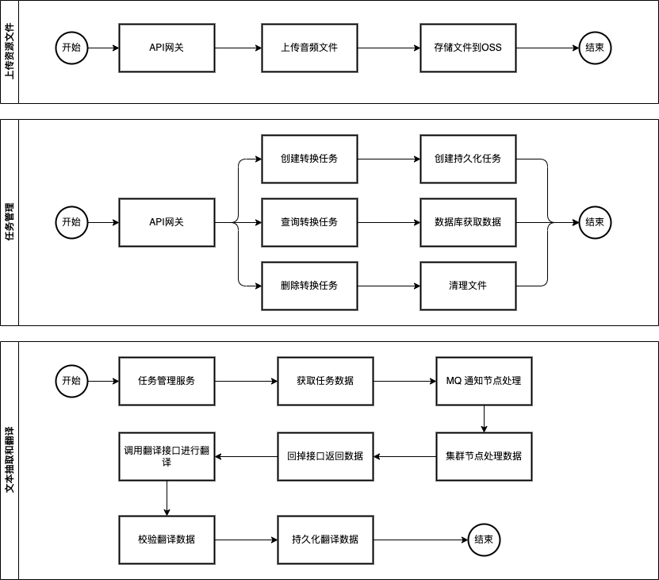
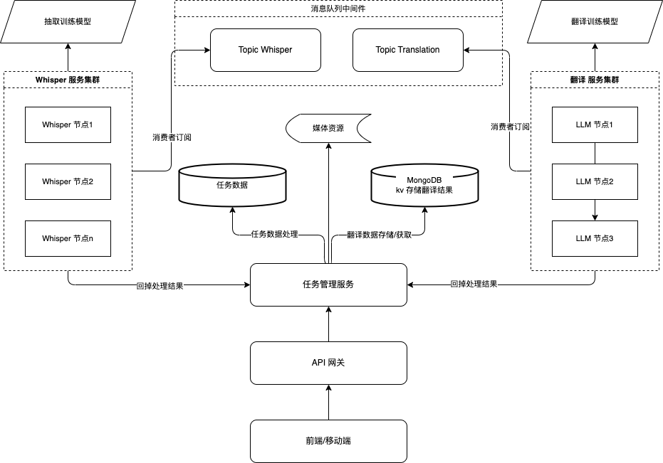

# whisper-demo

## whisper 安装

### 官方文档

参考 https://github.com/openai/whisper

### 环境准备

Python 3.8 ~ 3.13

- 测试环境使用 3.12，实测 3.13 有问题；
- numpy 2.x 版本有兼容性问题，降级为 1.26.4 版本

### 安装 whisper 运行文君

```bash
pip install -U openai-whisper numpy==1.26.4
```

### 启用 gpu

如果想启用 gpu 的计算能力，则需要安装驱动程序和对应的 cuda
下面是官方教程：https://pytorch.org/get-started/locally/ 里面有针对不同平台不同gpu的安装方法。
mac 不支持 gpu 开启。

- nvidia: https://github.com/NVIDIA/cuda-python
- amd: 两种方案，本质上 zluda 是使用 rocm 适配的 cuda 接口
    - https://rocm.docs.amd.com/en/latest/
    - https://github.com/lshqqytiger/ZLUDA

## 架构设计

### 服务流程

#### 服务流程简述

- **上传文件服务**：主要是将音频资源文件上传到 oss 文件服务器进行管理。
- **任务管理**：主要是创建、查询、删除 任务功能。
- **文本抽取和翻译**：在创建任务后，该异步流程对资源文件进行文本抽取和翻译处理。

#### 服务流程图



### 系统架构与设计

#### 系统架构简述

##### 消息中间件

负责对系统解耦，对数据抽取和翻译的核心压力进行分散，保证系统核心应用的可靠性。

##### Whisper 集群

whisper 作为底层媒体文件抽取服务，其本身使用 python 开发，转换操作耗费 gpu 性能（或cpu，不推荐）。

whisper 节点应该使用 python 接口服务开发，订阅消息中间件的 Topic，并在消费后进行数据抽取工作。

数据抽取过程应该有流程控制和异常处理机制，保证任务可以正常回调至任务管理服务。

##### 翻译 服务集群

1. 不同的节点可以使用不同的训练模型，有针对性的对不同语言进行翻译服务
2. 统一接口和回调数据格式，方便切换 LLM

##### 任务管理服务

仅进行简单的任务管理和接收回调接口处理数据功能。

1. 处理任务：
    1. 创建任务
    2. 查询任务信息
    3. 取消任务
2. 处理 whisper 接口
    1. 负责生产 whisper 数据，将媒体资源信息和抽取参数下放入消息队列等待消费
    2. 负责接收 whisper 回调接口数据，将 whisper 的抽取结果进行存储
3. 处理 翻译 LLM 接口
    1. 负责 将接收到的 whisper 文本数据 按照不同 的翻译语言放入消息队列等待消费
    2. 负责接收 翻译 LLM 回调接口数据，将翻译结果存持久化到数据库
    3. 待所有翻译结果都返回后，将翻译结果进行归类打包
    4. 提供查询翻译结果的接口

##### 翻译结果与打包

**设计要点**：

1. 使用 Map 映射 代码与关键数据的关系 以便可以减少存储空间，例如 1=中文 2=英文；T=Text，A=AUDIO 等
2. 可以使用 JSON 结构简单易懂，转换效率高，且检索方便
3. 数据应该持久化到数据库中，例如 使用 MangoDB 进行数据存储
4. 如果有必要，对热点数据提前内存缓存中例如 redis

JSON 结构举例：

```json
{
  "zh": {
    "文本编号1": {
      "A": "翻译结果",
      "T": "文本翻译结果"
    },
    "文本编号2": {
      "A": "翻译结果",
      "T": "文本翻译结果"
    }
  },
  "jp": {
    "文本编号1": {
      "A": "翻译结果JP",
      "T": "文本翻译结果JP"
    },
    "文本编号2": {
      "A": "翻译结果JP",
      "T": "文本翻译结果JP"
    }
  }
}
```

##### 可靠性、扩展性

1. 系统使用消息中间件对 whisper 任务和 翻译LLM 任务进行解耦，并保证可以进行动态扩缩容
2. 底层可使用容器化系统实现便捷的自动扩容缩容
3. 内存使用预估：
    1. 应当进行压测，并对节点内存进行合理分配
    2. 当前节点异常不影响其他翻译任务
4. 任务重试：
    1. 节点异常由 消息中间件 进行感知 并做 重发处理
    2. 节点处理应当有时长的预估和限制，超时任务应当进行重试处理
5. 故障转移方案
    1. 使用 consul, nacos 实现服务注册与发现
    2. 使用 mq 订阅监控节点存活状态
    3. 提供心跳接口定期检测节点状态
6. 服务调度
    1. 正常情况下 消息队列即可满足服务间的调度
    2. 也可以通过 服务注册与发现配合心跳接口获取节点状态，手动维护节点信息，更加灵活的分配资源
7. 故障重试策略
    1. **网络超时**：间隔 30 秒，重试 1 次
    2. **服务无效**：间隔 5 分钟，重试 2 次
    3. **资源不足**：间隔 30 分钟，重试 3 次

#####      

#### 系统架构图



### 工程说明

1. 工程为单模块应用，并未实现所有功能，只有大概思路
2. 未引入中间件
3. 可以运行，但是需要具备完整环境